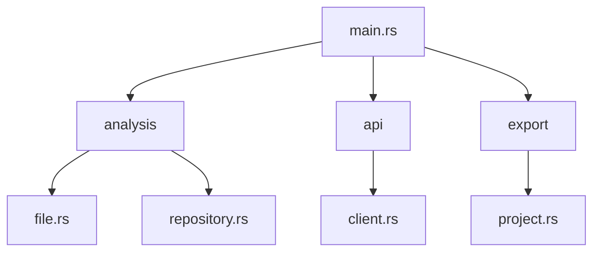

# 🔍 Rust Repository Analyzer

> Un analyseur statique pour explorer et comprendre les projets Rust avec une touche d'IA.

[](https://www.rust-lang.org/)
[](https://opensource.org/licenses/MIT)
[](https://docs.github.com/en/rest)

Un outil moderne pour analyser statiquement les dépôts Rust et générer des rapports détaillés compatibles avec les outils d'IA.

## ✨ Fonctionnalités

- **Analyse Complète du Code**
    - 📊 Détection des relations entre types
    - 🔄 Analyse des dépendances transitives
    - 🎯 Identification des traits implémentés
    - 📝 Analyse des signatures de méthodes

- **Support Multi-Format**
    - 📦 Analyse de multiples systèmes de build
    - 📋 Export en format JSON structuré
    - 🤖 Génération de rapports compatibles IA
    - 📑 Découpage intelligent des fichiers

- **Intégration GitHub**
    - 🔐 Support de l'authentification OAuth
    - ⏱️ Gestion intelligente du rate limiting
    - 🔄 Retry automatique des requêtes
    - 📂 Navigation récursive des dépôts

## 🚀 Pour Démarrer

```bash
# Installation
git clone https://github.com/LukaChassaing/rust-repo-analyzer.git
cd rust-repo-analyzer
cargo build --release

# Utilisation
cargo run https://github.com/utilisateur/repo
```

### Variables d'Environnement

```bash
GITHUB_TOKEN=votre_token  # Optionnel, augmente les limites d'API
```

## 📊 Structure du Projet



## 💡 Utilisation Avancée

```rust
// Analyse d'un dépôt avec export
let repo_url = "https://github.com/user/repo";
let analyzer = RepositoryAnalyzer::new();
let summary = analyzer.analyze(repo_url).await?;

// Export des résultats
let exporter = ProjectExporter::new(repo_url)?;
exporter.write_summary(&summary)?;
```

## 📝 Format de Sortie

Les résultats sont exportés dans un format structuré :

```
output/repo_name/
├── analysis.json       # Analyse complète en JSON
├── complete_analysis.txt   # Fichier unique pour IA
└── chunks/            # Fichiers découpés
    ├── chunk_0.txt
    └── ...
```

## 🤝 Contribution

Les contributions sont les bienvenues ! Voici comment participer :

1. Forkez le projet
2. Créez une branche (`git checkout -b feature/amazing-feature`)
3. Committez vos changements (`git commit -m 'feat: ajout fonctionnalité'`)
4. Pushez (`git push origin feature/amazing-feature`)
5. Ouvrez une Pull Request

## 📄 License

Ce projet est sous licence MIT - voir le fichier [LICENSE](LICENSE) pour plus de détails.

## 🙏 Remerciements

- [Reqwest](https://github.com/seanmonstar/reqwest) pour les requêtes HTTP
- [Serde](https://github.com/serde-rs/serde) pour la sérialisation
- [Tokio](https://github.com/tokio-rs/tokio) pour l'async runtime
- La communauté Rust pour son soutien incroyable

---

<div align="center">
Made with ❤️ by Luka Chassaing
</div>